# grundfos-alpha3
Share knowledge about Grundfos Alpha3 pumps.  
Other projects  
+ https://github.com/pdw-mb/esp32-recirc-pump-controller
+ https://www.holzheizer-forum.de/forum/thread/59829-reparaturanleitung-platine-grundfos-alpha2-modell-a-vor-2012/

## Table of content
<!-- vscode-markdown-toc -->
* [Table of content](#Tableofcontent)
* [Todo](#Todo)
* [How to open the housing](#Howtoopenthehousing)
* [Overview](#Overview)
* [Step 1: remove pump](#Step1:removepump)
* [Step 2: remove pump housing](#Step2:removepumphousing)
* [Step 3: remove display](#Step3:removedisplay)

<!-- vscode-markdown-toc-config
	numbering=false
	autoSave=true
	/vscode-markdown-toc-config -->
<!-- /vscode-markdown-toc -->

## Todo

+ [x] one
+ [ ] two

## How to open the housing
> [!WARNING]  
> The pump is obviously not made to get repaired. Everything is assembled with a snap system. After disassembling some plastic hooks / noses will be defective.

:warning: Discription of full disassembly.

## Overview

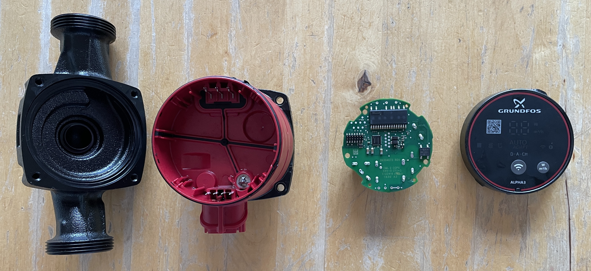 
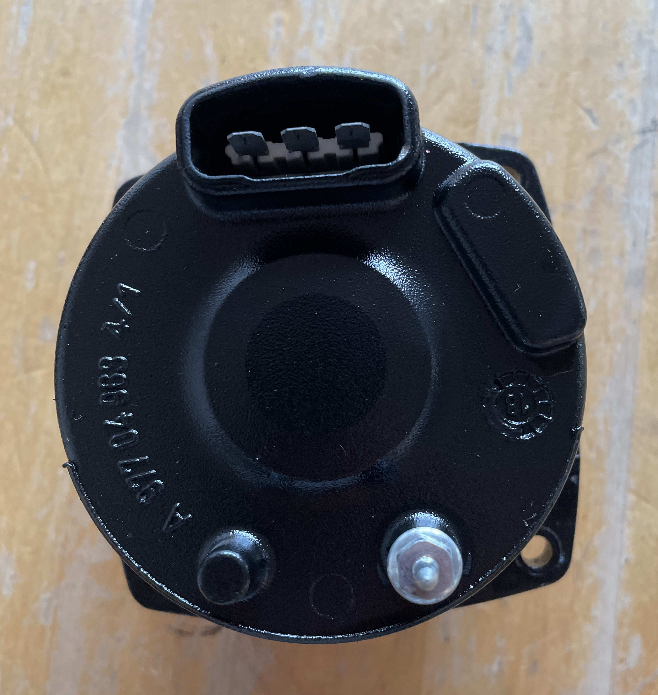
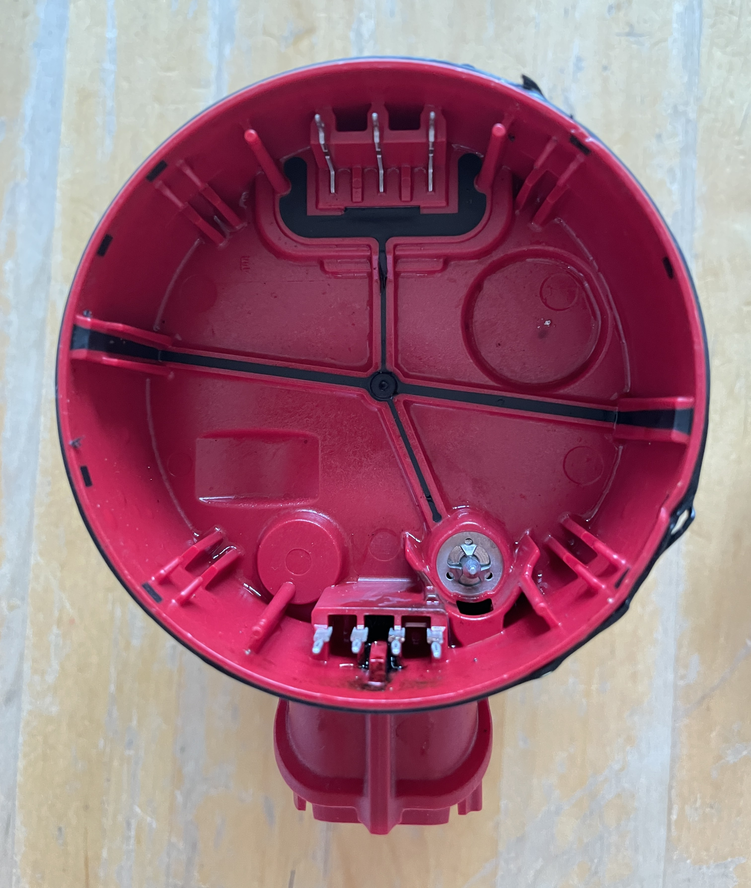
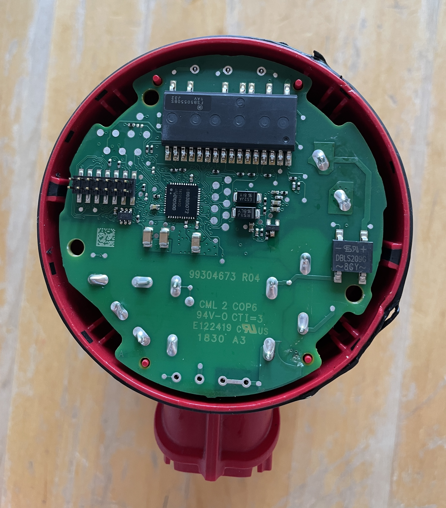
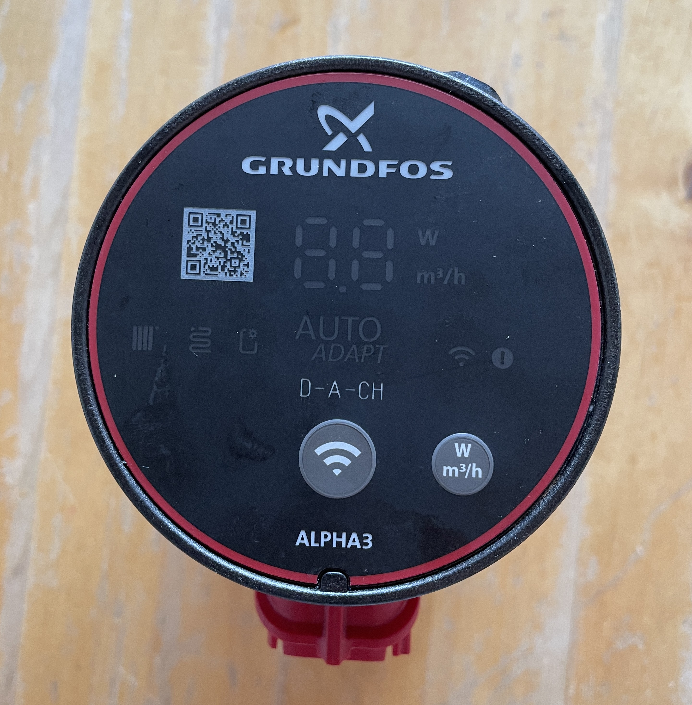

## Step 1: remove pump
This is the easy part. You have 4 inbus screws to remove. Pull the pump out. Thats it.

## Step 2: remove pump housing
Look at the housing. There are 4 slots. If you look closely you can see, that there is a snap system in two of the slots.
The good thing is, that you can use a screwdriver to lever out the latching nose.

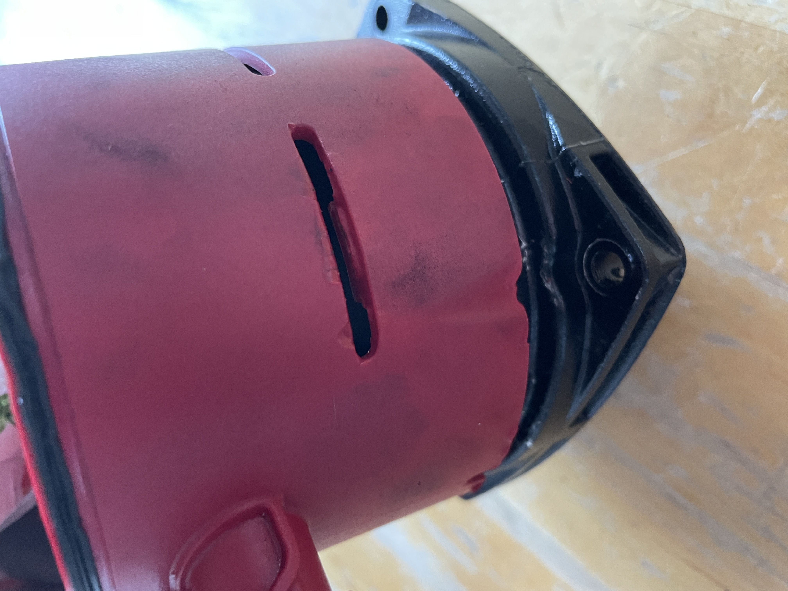
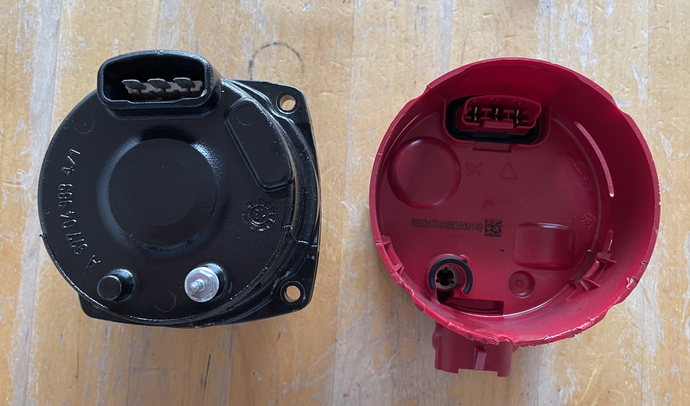

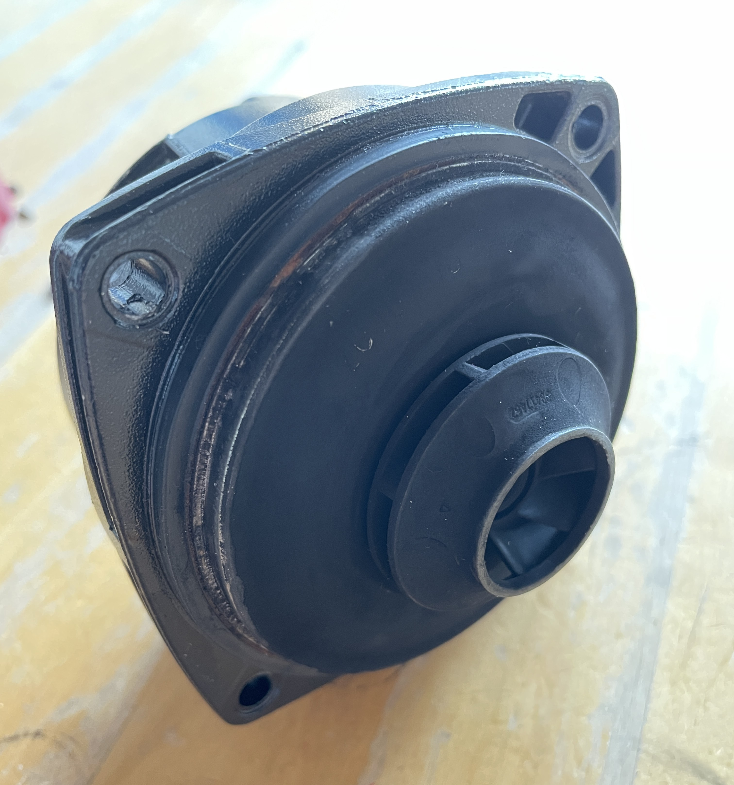

## Step 3: remove display
The display is hold in place by 4 hooks. Use a screwdriver go under the edge, near the hook and carefully lift off the display. You need some force and the plastic hook will break.

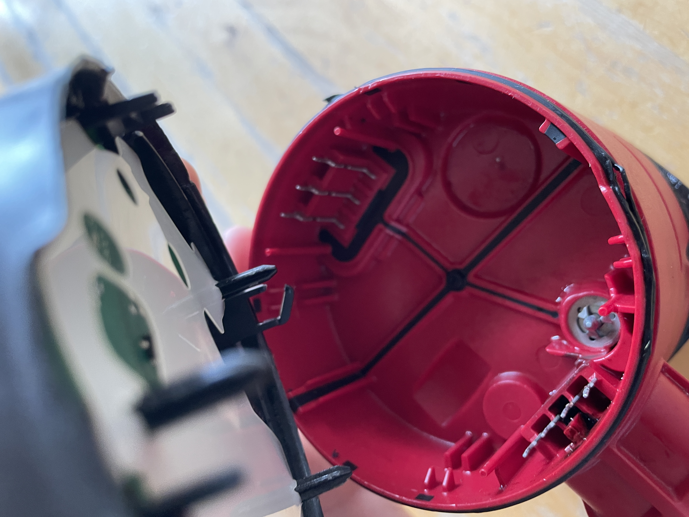
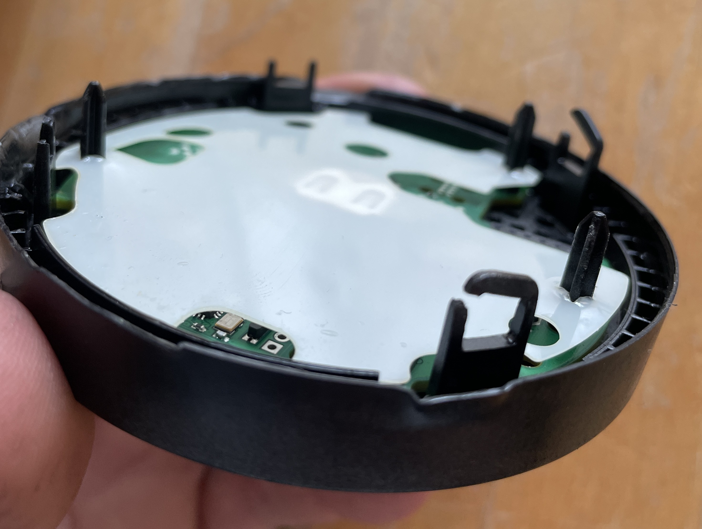

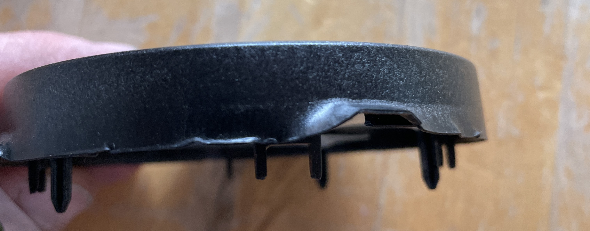 

You can see the damage of the hooks and the edge of the display.

Collection of Symbols  
:triangular_ruler:
:wrench:
:hammer_and_wrench:
:locked:
:unlocked:
:key:
:light_bulb:
:safety_vest:
:warning:
:no_entry:
:prohibited:
:red_question_mark:
:check_mark_button:
:cross_mark_button:
:check_mark:
:cross_mark:
:information:
:bust_in_silhouette:
:busts_in_silhouette:
:index_pointing_up:
:writing_hand:
